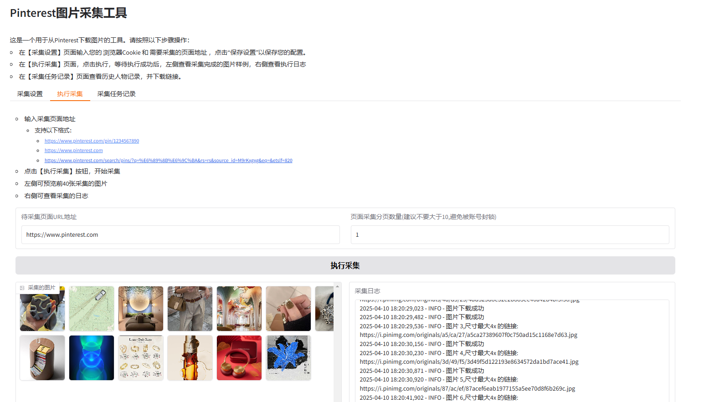
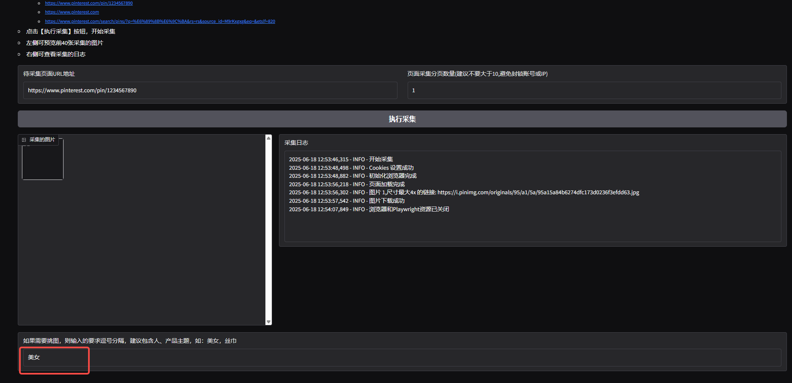

# Pinterest 图片采集及智能挑图工具

## 简介

这是一个用于从 Pinterest 采集图片的工具。

供了友好的用户界面、支持设置采集参数、图片采集、查看采集日志

并基于deepseek_janus_pro_7b模型 实现AI智能挑图 功能。(大于16G显存)

### 采集设置



### 采集结果


### AI挑图
输入挑图的条件


## 使用步骤

1. **设置 Cookie**：
    - 登录 Pinterest 网站：https://www.pinterest.com
    - 使用 `Ctrl+Shift+i` 打开浏览器开发者工具。
    - 切换到【网络】选项卡，选择任意请求，复制 Cookie。
    - 将复制的 Cookie 粘贴到工具的【采集设置】页面，并点击“保存设置”。

2. **执行采集**：
    - 在【执行采集】页面，输入需要采集的 Pinterest 页面 URL 和分页数量。
    - 点击“执行采集”按钮，工具将开始采集图片。
    - 采集完成后，左侧将显示采集到的图片预览，右侧将显示采集日志。

3. **查看任务记录**：
    - 在【采集任务记录】页面，可以查看所有历史采集任务的记录。
    - 选择任意任务文件夹，点击“打包”按钮，工具将生成 .zip 文件并提供采集链接。

## 部署

### docker build 镜像

```
   docker build -t pinterest-downloader .
```

### docker compose 本地启动

#### 配置修改

- PROXY_URL:修改代理服务器地址
- ZIP_DIR:下载的素材压缩包位置
- TASK_DIR：任务历史记录保存位置

#### 修改volumes配置

E:/Service/docker-volumes为你自己的本地目录

```
    environment:
      - PROXY_URL=http://192.168.1.12:10811
      - ZIP_DIR=/asset/zip
      - TASK_DIR=/asset/task
    volumes:
      - D:/Service/docker-volumes/task:/asset/task
      - D:/Service/docker-volumes/zip:/asset/zip
    command: python main.py --port 7861
```

#### 启动命令

```
    docker compose up -d
```

