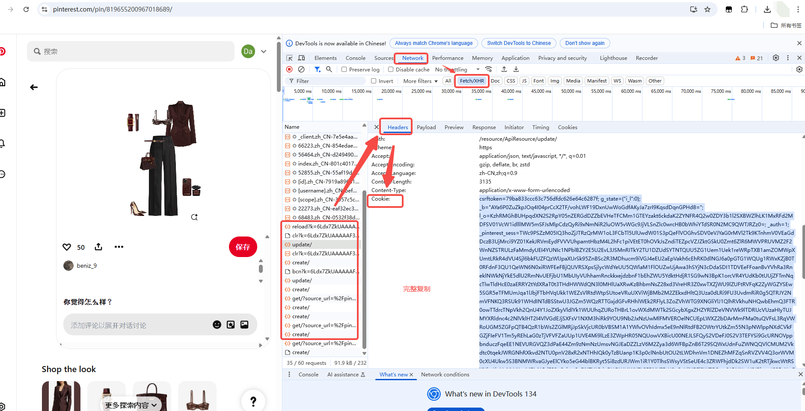

# Cookie 获取教程

本教程演示获取所需 `Cookie` 的方法

**方法\(推荐\)：**

1. 打开浏览器\(可选无痕模式启动\)，
2. 按 `F12` 打开开发人员工具
3. 选择 `（NetWork）网络` 选项卡，选择 `（Fetch/XHR）`过滤条件
4. 访问`https://www.pinterest.com/`
5. 完成登录
6. 选择任意请求，选择`Head（标头）`，找到`Cookie`
7. 复制`Cookie`即可

**截图示例：**

